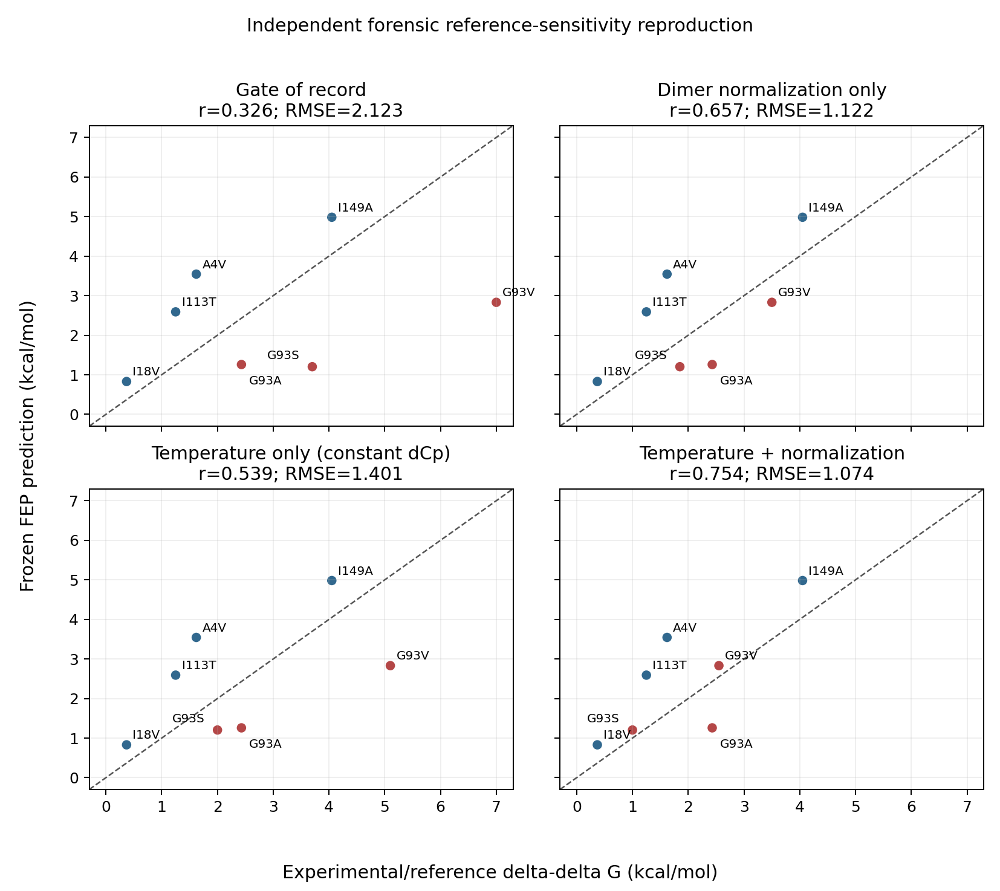

# Independent computational reproduction of Table 3 and Figure 4

**Completed 2026-09-14.** This is a clean-room computational cross-check of the forensic
reference-sensitivity result. It is not a new validation gate and does not change the failed
gate-of-record verdict.

## Independence boundary

[`reproduce_reference_sensitivity_independent.py`](../scripts/reproduce_reference_sensitivity_independent.py)
imports none of the project's validation, sensitivity, or configuration loaders. It:

1. reads the eight frozen JSON records directly from the local archive, using the attested
   A4V attempt-1 record;
2. reads the audited scenario CSV directly;
3. independently applies the documented 1.0 kcal/mol per-variant closure cap;
4. calculates Pearson correlation, tie-safe Spearman correlation, RMSE, and MUE from their
   defining equations using only the Python standard library; and
5. uses Matplotlib only to render an independent four-panel figure.

The independent filter excluded only F64A (closure 1.103760 kcal/mol) and retained the same
seven variants as Table 3.

## Reproduced result

| scenario | Pearson r | Spearman rho | RMSE | MUE |
|---|---:|---:|---:|---:|
| gate of record | 0.326 | 0.500 | 2.123 | 1.785 |
| dimer normalization only, constant dCp | 0.657 | 0.607 | 1.122 | 1.020 |
| temperature only, 25 C constant dCp, still dimer | 0.539 | 0.536 | 1.401 | 1.270 |
| temperature + normalization, constant dCp | 0.754 | 0.821 | 1.074 | 0.902 |
| 49.4 C, temperature-dependent dCp, still dimer | 0.340 | 0.500 | 2.091 | 1.756 |
| normalization only, temperature-dependent dCp | 0.666 | 0.607 | 1.115 | 1.006 |
| temperature only, 25 C temperature-dependent dCp, still dimer | 0.642 | 0.679 | 1.187 | 1.056 |
| temperature + normalization, temperature-dependent dCp | 0.767 | 0.750 | 1.117 | 1.009 |

All eight rows match [`reference_sensitivity_analysis.md`](reference_sensitivity_analysis.md)
at its displayed three-decimal precision. Full-precision output is preserved in
[`independent_reference_reproduction.json`](../data/independent_reference_reproduction.json).



Visual inspection confirmed that the independent figure contains the same seven labeled
points in each of the four scenarios and the same panel metrics as the official Figure 4.
Styling differences are intentional evidence that this is a separate rendering path.

## Reproduction

```bash
MPLCONFIGDIR=/tmp/sod1fep-independent-mpl \
python scripts/reproduce_reference_sensitivity_independent.py \
  --archive-root /Users/bodebosell/sod1fep_archive_2026-09-11 \
  --figure docs/figures/reference_sensitivity_independent.png \
  --json data/independent_reference_reproduction.json
```

Recorded SHA-256 checksums at completion:

| file | SHA-256 |
|---|---|
| audited scenario CSV | `f8c9bb7521b11cbf26c54dc2a197770c31b90c3180b3fc96abef20b6eb4d8566` |
| full-precision reproduction JSON | `57c2ffb2a4d5c76f2614e5782583e6d38470c7bab5def4577a651dd48e51aded` |
| independent script | `635a8b7663d29d9932707086bc3b59c616a8b5d68d7d9f4fbc72eb0f0eea8cd2` |
| independent figure | `7736023a5520d3b650e5a5624e37421e79db1f3b82210e15895e7cd6701a44f6` |

## Limitation

This closes the independent-implementation check, not the literal second-person requirement:
the same agent conducted and documented both paths. If external sign-off is required, another
person should run the command above and compare its output with Table 3 and Figure 4.
