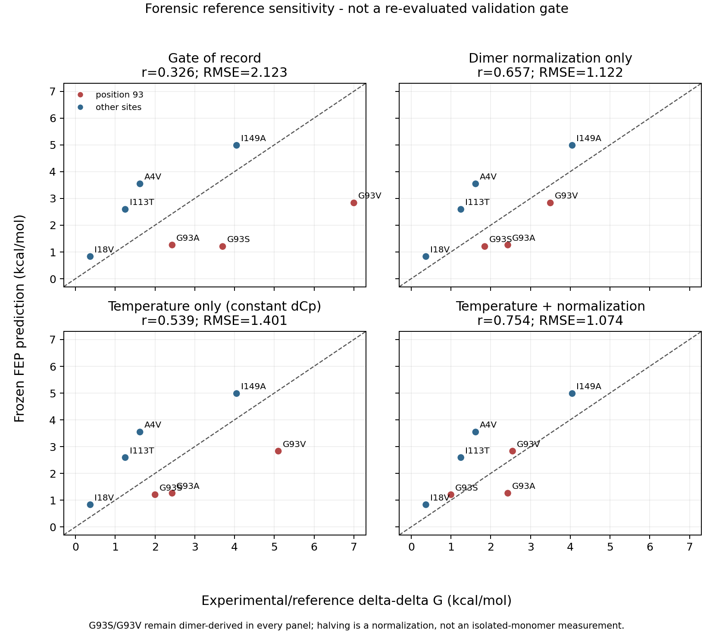

# Forensic reference sensitivity — frozen predictions, unchanged gate verdict

**Completed 2026-09-14. CPU only. This is not a new validation gate.** The pre-registered
gate remains failed at Pearson **r = 0.326** and **RMSE = 2.123 kcal/mol**. No control was
added or removed, no prediction was rerun, no threshold was changed, and F64A remains
excluded by its original convergence failure.

The purpose is narrower: quantify how much of the seven-point comparison depends on treating
Stathopulos's G93S/G93V apo-dimer DSC results as if they were 25 °C monomer measurements.



## 1. Frozen calculation side

The seven predictions are the exact gate-attempt-1 values. Six re-derive from the archived
NPZ windows; A4V's overwritten 3 ns windows do not, so its original run-time JSON remains the
attested source exactly as in [`stop_rule_reanalysis.md`](stop_rule_reanalysis.md).

| variant | frozen FEP ΔΔG | gate reference | original status |
|---|---:|---:|---|
| I18V | 0.8292 | 0.37 | used |
| I113T | 2.5908 | 1.25 | used |
| A4V | 3.5441 | 1.62 | used; run-time record only |
| G93A | 1.2587 | 2.43 | used |
| G93S | 1.2036 | 3.70 | used |
| I149A | 4.9819 | 4.05 | used |
| G93V | 2.8309 | 7.00 | used |
| F64A | 6.9443 | −0.20 | **excluded; closure 1.1038 > 1.0** |

The median absolute closure therefore remains 0.225 kcal/mol in every scenario. It is not
recomputed as a selection criterion because the usable set is frozen.

## 2. What Table 2 actually permits

Stathopulos Table 2 reports an apo native-dimer-to-two-unfolded-monomers model. Each displayed
ΔG cell has a constant-ΔCp value and an italicized temperature-dependent-ΔCp value. The final
paired ΔΔGs are those two heat-capacity calculations at the common `tavg = 49.4 °C`; they are
not the 49.4 °C and 25 °C columns.

| quantity (kcal/mol dimer) | pWT | G93S | G93V |
|---|---:|---:|---:|
| ΔG at 49.4 °C, constant ΔCp | 11.3 | 7.7 | 4.3 |
| ΔG at 49.4 °C, temperature-dependent ΔCp | 11.2 | 7.7 | 4.2 |
| ΔG at 25 °C, constant ΔCp | 17.3 | 15.3 | 12.2 |
| ΔG at 25 °C, temperature-dependent ΔCp | 15.8 | 14.4 | 11.6 |

The nominal positive-destabilizing effects follow from `ΔG(pWT) − ΔG(mutant)`:

| reference construction | G93S | G93V |
|---|---:|---:|
| gate of record: tabulated dimer ΔΔG at 49.4 °C | 3.70 | 7.00 |
| dimer total divided by two, 49.4 °C | 1.85 | 3.50 |
| 25 °C, constant ΔCp, whole dimer | 2.00 | 5.10 |
| 25 °C, constant ΔCp, divided by two | 1.00 | 2.55 |
| 25 °C, temperature-dependent ΔCp, whole dimer | 1.40 | 4.20 |
| 25 °C, temperature-dependent ΔCp, divided by two | 0.70 | 2.10 |

Dividing by two is a unit normalization for the cooperative dimer transition. It does
**not** turn the experiment into an isolated-monomer folding measurement, remove the dimer
association contribution, match the C6/C111 construct, or match the simulation's 2SH redox
state.

The 25 °C values are also much less precise than the gate column suggests. The reported
absolute ΔG uncertainties are ±2.4 kcal/mol for pWT, ±0.4 for G93S, and ±0.2–0.3 for G93V.
Naive independent-error propagation is therefore about ±2.4 kcal/mol per derived whole-dimer
ΔΔG (about ±1.2 after halving), not Kumar's blanket ±0.3.

## 3. Sensitivity results

Only G93S and G93V change between rows. All other references and all predictions remain fixed.

| scenario | Pearson r | Spearman ρ | RMSE | MUE |
|---|---:|---:|---:|---:|
| **gate of record** | **0.326** | 0.500 | **2.123** | 1.785 |
| dimer normalization only, constant ΔCp | 0.657 | 0.607 | 1.122 | 1.020 |
| temperature only, 25 °C constant ΔCp, still dimer | 0.539 | 0.536 | 1.401 | 1.270 |
| temperature + normalization, constant ΔCp | **0.754** | 0.821 | **1.074** | 0.902 |
| 49.4 °C, temperature-dependent ΔCp, still dimer | 0.340 | 0.500 | 2.091 | 1.756 |
| normalization only, temperature-dependent ΔCp | 0.666 | 0.607 | 1.115 | 1.006 |
| temperature only, 25 °C temperature-dependent ΔCp, still dimer | 0.642 | 0.679 | 1.187 | 1.056 |
| temperature + normalization, temperature-dependent ΔCp | **0.767** | 0.750 | **1.117** | 1.009 |

Against the original numerical thresholds, both combined nominal scenarios happen to exceed
r = 0.70 and fall below RMSE = 1.5. **That is not a pass.** These values were constructed
after the verdict, two of seven references are still not the simulated observable, and their
25 °C uncertainties are large. Calling either row a gate would be exactly the post-hoc
redefinition the pre-registration was designed to prevent.

What the calculation does establish is that the failed aggregate metrics are highly sensitive
to reference normalization and temperature treatment at the two highest-leverage points.
The gate-of-record measured calculation error plus benchmark heterogeneity; it cannot identify
their separate contributions.

## 4. Approved reference-state scope

The evidence now supports one bounded path for the current project:

1. **Keep v1 apo-2SH and end GPU work.** This preserves the biologically motivated scope and
   the pre-registered pivot. The G93A SS diagnostic changed folded ΔG by only −0.0169 kcal/mol,
   so one direct test gives no basis for converting the full campaign to apo-SS.
2. **Do not claim the failed heterogeneous gate validates or invalidates apo-2SH FEP alone.**
   Report the gate as failed, then show this sensitivity as the quantitative benchmark audit.
3. **For any future predictive campaign, pre-register a new benchmark made from matched
   apo-2SH controls.** If a sufficiently large matched set cannot be assembled, the honest
   alternative is a separately designed apo-SS campaign—not silently mixing the two states.

The user explicitly approved this path on 2026-09-14. The current project therefore retains
apo-2SH, ends GPU work, and retires C1 and C3. Because no VUS prediction campaign will be
performed, C4 is deferred and is not a current claim. This approval is not authorization for
an apo-SS campaign; any future predictive campaign requires a new matched benchmark,
preregistration, and explicit approval. The original gate verdict remains unchanged.

## 5. Reproduction

The source table is [`data/reference_sensitivity_scenarios.csv`](../data/reference_sensitivity_scenarios.csv),
and the CPU analysis/figure builder is
[`src/analysis/reference_sensitivity.py`](../src/analysis/reference_sensitivity.py).

```bash
MPLCONFIGDIR=/tmp/sod1fep-mpl python -m src.analysis.reference_sensitivity \
  --archive-root ~/sod1fep_archive_2026-09-11 \
  --figure docs/figures/reference_sensitivity.png
```

The command fails closed if A4V's original record is absent, a gate variant is missing, F64A
is no longer the sole excluded point, provenance/protocol checks fail, or the original inputs
do not reproduce the failed seven-point gate.

## 6. Archive verification performed with this analysis

The local SS diagnostic is present at
`~/sod1fep_archive_2026-09-14/G93A_SS_diagnostic/` with its `MANIFEST.md`, `ddg_SS.json`,
`convergence_SS.json`, 60 folded and 60 unfolded NPZs. Every NPZ is finite, has shape
`(20, 3001)`, provenance `gromacs_pmx`, protocol `822108e9db71124d`, and three records per
lambda index. Direct parsing of all three folded `hybrid.top` files finds the C57–C146 SG–SG
bond, no HG on C57/C146, and HG retained on C6/C111.

The separate local 2SH baseline remains at
`~/sod1fep_archive_2026-09-11/fep/G93A/`, also complete at 120 NPZs. Its three folded
topologies contain no SG–SG bond and retain HG on all four cysteines. This proves local archive
separation and the identities of both trees. It does **not** prove that the live SCC directory
was restored after the diagnostic or that the SS tree has a second SCC copy. A read-only SSH
retry on 2026-09-14 reached `scc1.bu.edu` but failed authentication before any remote path could
be read, so both checks remain explicitly open.
